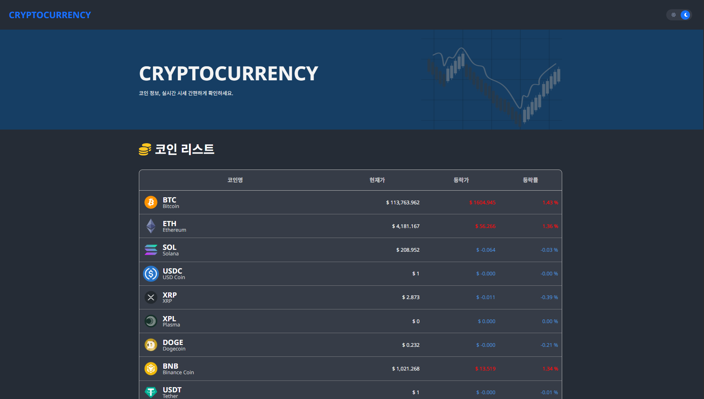

# CryptoCurrency

React와 Typescript로 구축한 암호화폐 시세 조회 웹 애플리케이션

### 🖥️ 프로젝트 소개

---

실시간으로 다양한 암호화폐 50종의 시세를 확인하고,
상세정보와 차트를 통해 가격 변동을 한눈에 파악할 수 있는 웹페이지입니다.
 
'CryptoCompare'가 지원하는 Open API를 사용해 코인 시세데이터를 불러와 제작했습니다.
 
https://cryptocurrency-j.web.app/ <-- 프로젝트 링크!

#### 개발 기간 : 2023.05.15~ 2023.06.01 (3주)

#### 개인 토이 프로젝트입니다.

### ⚙️ 개발 환경

---

- IDE : 
- Stack :  
  
  
- SCM : 

## 🎯 구현 내용

#### 1. 데이터 페칭 최적화

React Query를 활용하여 캐싱, 리페칭, 로딩 상태를 효율적으로 관리

#### 2. 타입 안정성

TypeScript를 통한 API 응답 데이터 타입 정의 및 컴파일 타임 오류 방지

#### 3. UX 고려

- 로딩 스피너
- 에러 처리
- 반응형 레이아웃

## 📖 배운 점

- React Query의 `useQuery` 훅을 활용한 서버 상태 관리
- Styled Components의 ThemeProvider를 통한 `다크모드` 구현
- ApexCharts를 활용한 `데이터 시각화`
- TypeScript 제네릭을 활용한 타입 안전한 API 함수 작성
